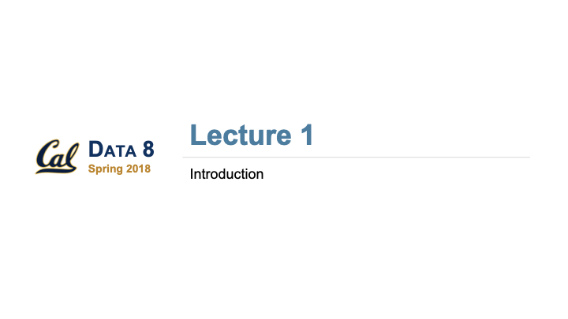

## AI Education at Scale {.opening-slide}

### What can we learn from data science?

**Eric Van Dusen**  
UC Berkeley  
College of Computing, Data Science, and Society

**AI at Sciencepark · Amsterdam**

::: {.title-logos}
{.berkeley-logo fig-alt="UC Berkeley"}

{.cdss-logo fig-alt="UC Berkeley College of Computing, Data Science, and Society"}
:::

::: notes
I want to talk about AI education by starting somewhere slightly different:
with what we learned over the last decade trying to teach data science at scale.

My argument is that we already know quite a lot about how to make computational ideas accessible.

But AI also changes what we need to teach — and raises a bigger question about what kind of technical infrastructure universities should depend upon.
:::

---

## What we learned from Data 8 {.data8-slide}

:::: {.columns}
::: {.column width="66.667%"}

- Start with **doing**, not prerequisites
- Real questions + real datasets
- Short computational explorations
- Introduce programming, statistics and concepts as needed
- Use the **real tools**
- Reach students outside computer science

> We didn't make students learn all the machinery before we let them do data science.

:::

::: {.column .data8-visuals width="33.333%"}
{.data8-logo fig-alt="Data 8: Foundations of Data Science"}

{.data8-deck fig-alt="Opening slide of the Data 8 Spring 2018 Introduction lecture deck"}

::: {.data8-source}
[Data 8 · Introduction, Spring 2018](https://www.data8.org/materials-sp18/lec/lec01PDF.pdf)
:::
:::
::::

::: notes
At Berkeley, Data 8 was an experiment in changing the order in which students encounter technical material.

The traditional approach says: learn programming, then statistics, then perhaps linear algebra, and eventually you can do interesting things with data.

We inverted that.

Give students an interesting question and real data immediately.

Then introduce computation and statistical ideas as they become useful.
:::

---

## The notebook became the laboratory

### Browser → Notebook → Data → Experiment

- Jupyter + Python + real data
- Change code → immediately see what happens
- Same environment for instructors and students
- Reproducible across a class
- Works for 20 students — or thousands
- Open-source tools + open curriculum + shared infrastructure

::: notes
One piece of infrastructure was particularly important: the notebook.

The notebook became a laboratory.

Students didn't have to configure a development environment before doing an experiment.

They opened a browser and started investigating.

And underneath that apparently simple experience was shared infrastructure that made the environment reproducible at scale.
:::

---

## What if we did the same thing with AI?

### Put a model in the notebook.

- Prompt it
- Change parameters
- Examine tokens and probabilities
- Create embeddings
- Add retrieval
- Compare models
- Build evaluations
- Investigate failures

> **The notebook can become a laboratory for AI.**

::: notes
So here's the obvious question.

Can we use the same pedagogical pattern for AI?

Rather than beginning with a lecture explaining transformer architecture, give students a model.

Let them manipulate it.

Let them form hypotheses about its behavior and test them.

Then use those experiences to motivate the underlying ideas.
:::

---

## Small models are enough to learn a lot

### You don't need a frontier model for every experiment.

- 1B–7B parameter models
- Downloadable
- Run locally or on shared infrastructure
- CPU for some experiments; GPUs when needed
- Instructor-selected and tested
- Reproducible across a class
- **Actual AI models — not educational simulations**

::: notes
This is where small models become pedagogically interesting.

We're often mesmerized by the capabilities of the largest frontier models.

But that doesn't mean they're the best educational objects.

For many things we want students to learn, a one, two, three, or seven billion parameter model is more than enough.

And small models make the technology tangible in a way that an API often doesn't.
:::

---

## But I think something else is changing {.shift-slide}

### What counts as technical literacy?

:::: {.columns}
::: {.column width="50%"}
[Traditional computing / ML]{.flow-label}

::: {.flow .flow-old}
- Programming
- Mathematics
- Data structures
- Algorithms
- Machine learning
:::
:::
::: {.column width="50%"}
[Modern AI workflow]{.flow-label}

::: {.flow .flow-new .flow-compact}
- Data
- Models
- APIs
- Containers
- Cloud
- Deployment
- Evaluation
- Monitoring
:::
:::
::::

::: {.bottom-question}
Are we moving from teaching **algorithms** to teaching **systems**?
:::

::: notes
This is the part I'm less certain about — and perhaps the more provocative part of the talk.

I think the object we're teaching is changing.

Computer science education has traditionally emphasized programming, mathematics and algorithms.

Those things remain incredibly important.

But increasingly the unit of computation that students encounter is not an algorithm.

It's a system.
:::

---

## Students need to see the whole stack {.stack-slide}

:::: {.columns}
::: {.column width="52%"}
::: {.contrast}
A student can understand **gradient descent** but have no idea how an AI application actually works.
:::

::: {.contrast}
A student can now build an **AI application** without understanding gradient descent.
:::

[Both are educational problems.]{.both}
:::
::: {.column width="48%"}
- Data engineering
- APIs
- Containers and reproducible environments
- Cloud / GPUs / inference
- MLOps / LLMOps
- Evaluation and monitoring
:::
::::

::: {.bottom-question}
**Teach enough engineering that the system stops looking like magic.**
:::

::: notes
I'm not arguing that we stop teaching mathematics and start teaching Docker.

But I do think the balance is changing.

Students need enough exposure to the engineering workflow that they understand how the pieces fit together.

Where does the data come from?

Where is the model?

Where does inference happen?

What is running locally and what is running in the cloud?

How do we evaluate it?

How do we know when it fails?
:::

---

## Who owns the laboratory? {.lab-slide}

:::: {.columns}
::: {.column width="50%"}
### Commercial AI

::: {.flow .flow-commercial}
- Notebook
- API
- Proprietary model
- Commercial cloud
:::

[Student learns to **consume** AI]{.outcome .outcome-commercial}
:::
::: {.column .fragment width="50%"}
### Open AI

::: {.flow .flow-open}
- Notebook
- Open-source tooling
- Open model
- Shared / public compute
:::

[Student can **inspect, modify, evaluate and build**]{.outcome .outcome-open}
:::
::::

::: notes
And this brings us to a question that universities should be thinking very seriously about.

Who owns the laboratory?

The easiest way to teach AI right now is to tell students to get an API key.

That is extraordinarily convenient.

But if every educational experience ends at a proprietary API, we're teaching a particular relationship with technology.

The student becomes a consumer of intelligence as a service.
:::

---

## Small + Open + Public {.europe-slide}

### A European opportunity?

:::: {.columns}
::: {.column width="46%"}
Europe doesn't necessarily have to win the race for the **biggest model**.

Perhaps it can compete differently.
:::
::: {.column width="54%"}
- Smaller and more efficient models
- Open weights
- Open-source software
- Shared public compute
- University and research infrastructure
- Open educational materials
- People who understand the entire stack
:::
::::

::: {.bottom-question}
Can Europe build a lighter-weight, open AI ecosystem rather than simply reproducing the hyperscalers?
:::

::: notes
This seems particularly interesting here in Europe.

The dominant AI story is a story of scale:
more GPUs, more parameters, bigger data centers, and enormous capital investment.

But perhaps there is another competitive strategy.

Europe has an extraordinary open-source tradition.

Hugging Face has French roots.

There is significant public research infrastructure.

And universities are places where open tools can be developed, taught, tested and normalized.

Maybe the goal isn't simply to reproduce the hyperscaler.
:::

---

## What should the university build? {.build-slide}

::: {.build-wrap}
::: {.build-stack}
::: {.layer .l6}
**Students across the disciplines**
:::
::: {.layer .l5}
**Open curriculum**
:::
::: {.layer .l4}
**Interactive notebooks**
:::
::: {.layer .l3}
**Open-source tooling**
:::
::: {.layer .l2}
**Open models**
:::
::: {.layer .l1}
**Public / shared compute**
:::
:::
::: {.build-side}
::: {.side-top}
**Simple for students and instructors:** open a notebook, choose a model, run an experiment.
:::
::: {.side-bottom}
**Substantial infrastructure underneath,** built and shared by universities.
:::
:::
:::

::: notes
This is the stack I'm interested in building.

There can be substantial computing infrastructure underneath.

But the experience for an instructor or student should remain simple.

Open a notebook.

Choose a model.

Run an experiment.

Understand enough of the layers underneath that you know what is actually happening.
:::

---

## Three ideas

### 1. Interactive pedagogy

We know how to make technical ideas accessible through **exploration**.

### 2. Systems literacy

Students need to understand **workflows**, not only algorithms.

### 3. Open infrastructure

Universities should help students become **builders**, not simply customers.

::: notes
So I want to leave you with three ideas.

First, we shouldn't throw away what we've learned about teaching computational subjects. Interactive exploration works.

Second, AI may require us to expand our definition of technical literacy from algorithms toward systems.

And third, universities have a choice about the infrastructure on which we build this education.

Ten years ago, we asked how every student could learn with data.

Now we're asking how every student can learn with AI.

We already know a surprising amount about how to do this.

But this time, we also have to decide what kind of AI ecosystem we're teaching students to participate in.
:::
