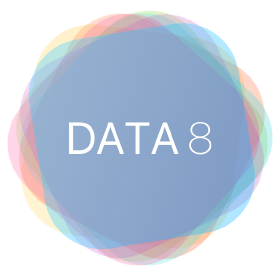
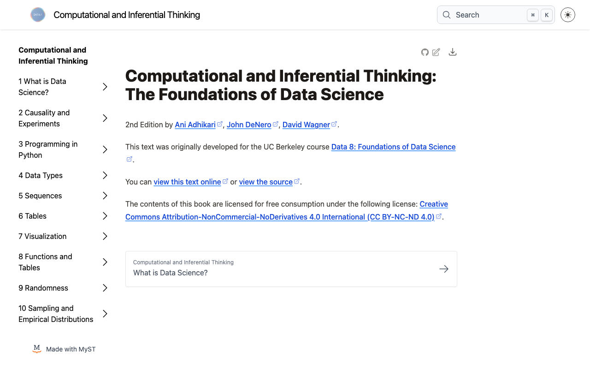
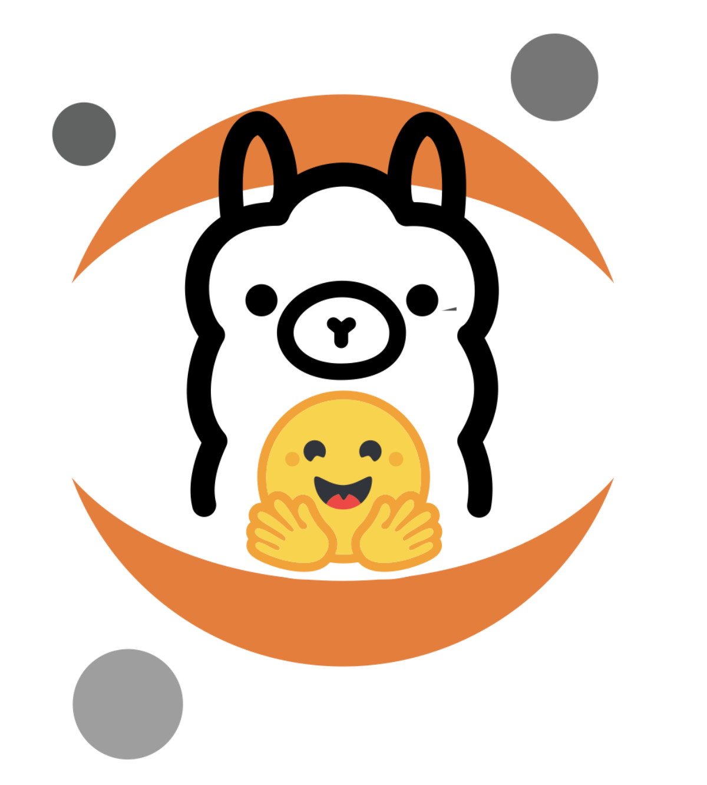
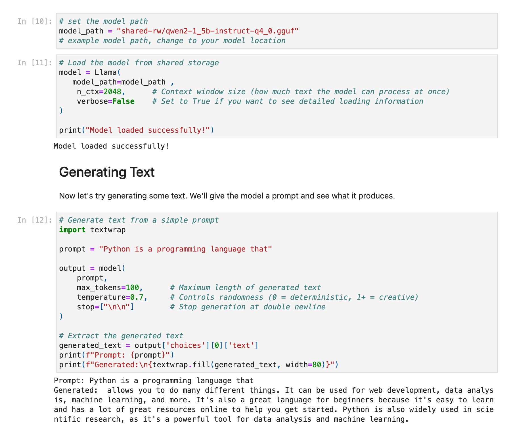

## Teaching AI the Way We Teach Data Science {.title-dark background-color="#061436"}

[Open, hands-on, built to scale]{.subtitle}

::: {.byline}
**Eric Van Dusen**<br>
College of Computing, Data Science, and Society, UC Berkeley<br>
October 9, 2026
:::

::: {.title-logos}
{.berkeley-logo fig-alt="UC Berkeley"}

{.cdss-logo fig-alt="UC Berkeley College of Computing, Data Science, and Society"}
:::

## The Data 8 Story  {.title-logo fig-alt="Data 8 logo"}

:::: {.columns}
::: {.column width="45%"}
::: {.statement}
A first course in computing and statistics, for any major, in the browser, with real data from day one.
:::

::: {.statement-2}
*Largest course at UC Berkeley - up to 50% of undergraduates take it, and the gateway to Berkeley's biggest major.*
:::
:::
::: {.column width="55%"}
{.shot fig-alt="Computational and Inferential Thinking, the open Data 8 textbook"}

[inferentialthinking.com]{.caption}
:::
::::

::: notes
1 min. The original wager behind Data 8. It became one of the largest courses at Berkeley and spread far beyond it. Question for the room: what would AI literacy look like if we made the same bet?
:::

## Three lessons from a decade of scaling {.lessons-slide}

[1. What do we know works?]{.kicker}

:::: {.columns}
::: {.column width="33%"}
### Remove friction
JupyterHub means no installs and no laptop gap. Students meet ideas before they fight environments.
:::
::: {.column width="33%"}
### Connect to disciplines
Connector courses (like Data 88E) provide domain context that makes methods stick.
:::
::: {.column width="33%"}
### Open everything
Github Deployment, Open Stack of tools,  Open textbook, notebooks, and autograding are what let it travel.
:::
::::

::: notes
4 min. Openness was not ideology, it was the distribution mechanism: community colleges, other states, other countries.
:::

## Scale is more than course materials

[1. What do we know works? How to get 25 community colleges to adopt it?]{.kicker}

- **Infrastructure:** shared JupyterHubs through for less resourced institutions ( eg NSF Cloudbank or Cal-ICOR) 
- **Curriculum:** open materials community colleges can adopt and adapt
- **People:** faculty networks, workshops training, and credit that transfers

::: {.big-idea}
How much of this can we do for AI education?
:::

::: notes
1 min bridge. The California story in one breath, then move on.
:::

## AI Education - how to keep the playing field level 

[2. Can we adapt what we teach?]{.kicker}

- Some iterations of AI literacy risk  shrinking into prompting tips and tricks
- Teaching through a rented chatbot teaches a **product**, not a **field**
- Closed access re-creates equity gaps: some students/institutions can pay, others cannot

::: notes
2 min. This is where the event's skills gap and diversity question gets answered structurally.
:::

## Small Open Models as teaching tools {.model-slide}

[2. Can we adapt what we teach?]{.kicker}

:::: {.columns}
::: {.column width="42%"}
A small open model is just a file students can count, inspect, and test.

- Parameters × bits ÷ 8 = size
- Tokens and next-token probabilities
- Temperature: what "randomness" means
- The linear algebra underneath
- "harness" - feed data in, get data out with data manipulation
:::
::: {.column width="58%"}
```{.python code-line-numbers="false"}
from transformers import AutoTokenizer, AutoModelForCausalLM

name = "HuggingFaceTB/SmolLM2-135M"   # a 270 MB file
tok = AutoTokenizer.from_pretrained(name)
lm = AutoModelForCausalLM.from_pretrained(name)

ids = tok("Amsterdam is famous for its", return_tensors="pt")
probs = lm(**ids).logits[0, -1].softmax(-1)

for p, i in zip(*probs.topk(5)):
    print(tok.decode(i), f"{p:.0%}")
```

{.center-logo fig-alt="Hugging Face, Ollama, and Jupyter logos combined"}
:::

::::

::: notes
3 min. Demystification as literacy.
:::

## Small Models in a Jupyter Hub 

[2. Can we adapt what we teach?]{.kicker}

:::: {.columns}
::: {.column width="58%"}
{.shot fig-alt="Jupyter notebook loading a small Qwen model from a local file and generating text"}
:::
::: {.column width="42%" .try-text}
The model downloads into a shared location on *JupyterHub* and runs in browser. Students can inspect the model, change parameters, and see what happens, e.g. with no setup.

**Admin sets up environment, prof sets up curriculum, student explores.**

[[Cloudbank Classroom](https://www.cloudbank.org/training/access-cloudbank-classroom): cloudbank.org/training/access-cloudbank-classroom]{.caption}
:::
::::

::: notes
2 min. Live demo. Have a recorded fallback ready in case the room wifi struggles.
:::

## Small Models in the Browser {.lite-slide}

[2. Can we adapt what we teach?]{.kicker}

:::: {.columns}
::: {.column width="36%" .lite-qr}
{fig-alt="QR code linking to the JupyterLite AI demo"}

**Try it now**

[jupyterlite.github.io/ai](https://jupyterlite.github.io/ai/lab/index.html)
:::
::::: {.column width="64%"}
{.lite-logo fig-alt="JupyterLite"}

The whole notebook, and the model, runs on your own laptop. **No account. No server. No cost.**

- **jupyterlite-ai**: chat and code completion inside JupyterLite
- **Pyodide**: Python compiled to WebAssembly
- **WebLLM**: LLMs on your GPU through WebGPU
- **Transformers.js**: Hugging Face models in the browser
- **wllama**: llama.cpp compiled to WebAssembly

[Thanks to Jeremy Tuloup! ]{.caption}
:::::
::::

::: notes
2 min. Live demo. Have the audience scan the QR code. Have a recorded fallback ready in case the room wifi struggles.
:::

## Same notebook, three rungs {.rungs-slide}

[3. What investments do we need?]{.kicker}

::: {.stairs}
::: {.rung .r1}
[1]{.rung-num}

### Browser
[JupyterLite]{.rung-tech}

Small models run on the student's own laptop. Free, private, zero setup.
:::

::: {.rung .r2}
[2]{.rung-num}

### Campus hub
[JupyterHub]{.rung-tech}

Shared model folders, curated environments, GPUs when a course needs them.
:::

::: {.rung .r3}
[3]{.rung-num}

### HPC and cloud slices
[Jupyter as the front door]{.rung-tech}

A small allocation for every student who needs one. Powerful but hard to use today, so **invest in making it easy**.
:::
:::

::: {.along-the-way}
**Teach the stack along the way:** environments, containers, git, job schedulers, cloud costs. DevOps is part of AI literacy.
:::

::: notes
3 min. Same notebook, moving up the stairs as the work gets bigger. The browser proves openness is possible; the hub makes it fair; HPC slices give students real compute, if we invest in a Jupyter front door. Each step up is a chance to teach how computing infrastructure actually works.
:::

## The model question

[3. What investments do we need?]{.kicker}

- Today's small open models come mostly from a few labs, mostly China
- Corporate openness can change with the next release ( e.g. OpenAI, Google, Meta)
- Build open curriculum that is flexible enough to swap models in and out, but worth having a small open model that is always available for teaching

::: notes
1 min. Verify the latest on Meta's and other labs' release policies before Thursday.
:::

## Europe has pieces at every rung

[3. What investments do we need?]{.kicker}

| Rung | European pieces |
|---|---|
| Browser | QuantStack, JupyterLite |
| Campus hub | SURF and national research infrastructure |
| Public compute | EuroHPC |
| Models | GPT-NL, OpenEuroLLM |

[Plus a mandate: AI literacy under Article 4 of the EU AI Act]{.caption}

::: notes
1 min. Check GPT-NL and OpenEuroLLM availability before naming them as downloadable today.
:::

## Two Goals 

[3. What investments do we need?]{.kicker}

:::: {.columns}
::: {.column width="50%"}
::: {.big-idea}
A small, fully open, multilingual **teaching model** with documented data
:::
:::
::: {.column width="50%"}
::: {.big-idea}
Shared open **curriculum** that runs at multiple levels and can move between universities
:::
:::
::::

::: notes
1 min. Not one more model, but the infrastructure and curriculum that let every student climb the ladder.
:::

## Data Science to AI

::: {.statement}
We are still scaling data science.

<br>Next: give everyone the ability<br>to look inside AI.
:::

**For the panel:** who should own the infrastructure that teaches the next generation what AI is?


[ericvd@berkeley.edu]{.caption}

::: notes
1 min. Hand off to the panel with the question.
:::
